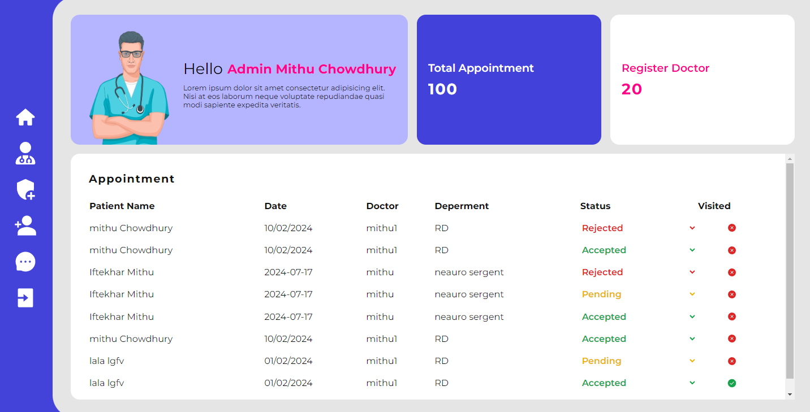

# 🏥 Hospital Management React Dashboard

Welcome to the Hospital Management React Dashboard! This project is a comprehensive solution for managing hospital operations efficiently. It allows administrators to add doctor details, manage patient appointments, and update application statuses.

## 📋 Table of Contents

- [Features](#features)
- [Installation](#installation)
- [Usage](#usage)
- [Screenshots](#screenshots)
- [Technologies](#technologies)
- [Contributing](#contributing)
- [License](#license)

## ✨ Features

- **Admin Panel:**
  - Add, edit, and remove doctor details
  - Manage patient appointments
  - Update the status of various applications
- **User-Friendly Interface:**
  - Intuitive design for easy navigation
  - Responsive layout for use on various devices
- **Secure and Efficient:**
  - Role-based access control
  - Secure data handling and storage

## 🛠️ Installation

To get a local copy up and running, follow these steps:

1. **Clone the repository:**

   ```sh
   git clone https://github.com/iftekharalammithu/Hospital-Admin-Dashboard.git
   ```

2. **Navigate to the project directory:**

   ```sh
   cd Hospital-Admin-Dashboard
   ```

3. **Install dependencies:**

   ```sh
   npm install
   ```

4. **Start the development server:**
   ```sh
   npm start
   ```

## 🚀 Usage

After installing the dependencies and starting the development server, open your browser and navigate to `http://localhost:3000`. You will be greeted with the login page. After logging in as an admin, you can:

- Add new doctors and their details
- View, schedule, and manage patient appointments
- Update the status of patient applications

## 📸 Screenshots



## 💻 Technologies

- **Frontend:**
  - React.js
  - Redux
  - Material-UI
- **Backend:**
  - Node.js
  - Express.js
- **Database:**
  - MongoDB

## 🤝 Contributing

Contributions are what make the open-source community such an amazing place to learn, inspire, and create. Any contributions you make are **greatly appreciated**.

1. Fork the Project
2. Create your Feature Branch (`git checkout -b feature/AmazingFeature`)
3. Commit your Changes (`git commit -m 'Add some AmazingFeature'`)
4. Push to the Branch (`git push origin feature/AmazingFeature`)
5. Open a Pull Request

---

Follow on social media:

[
](https://x.com/M1thuChowdhury)
[
](https://www.linkedin.com/in/iftekharalammithu/)
[
](https://www.instagram.com/iftekharalammithu/)

<div style="text-align: center;">
  <a href="https://www.buymeacoffee.com/iftekharalammithu">
    
  </a>
</div>

---

⭐ Don't forget to star the repository if you find it useful!

For any inquiries or feedback, feel free to reach out.
